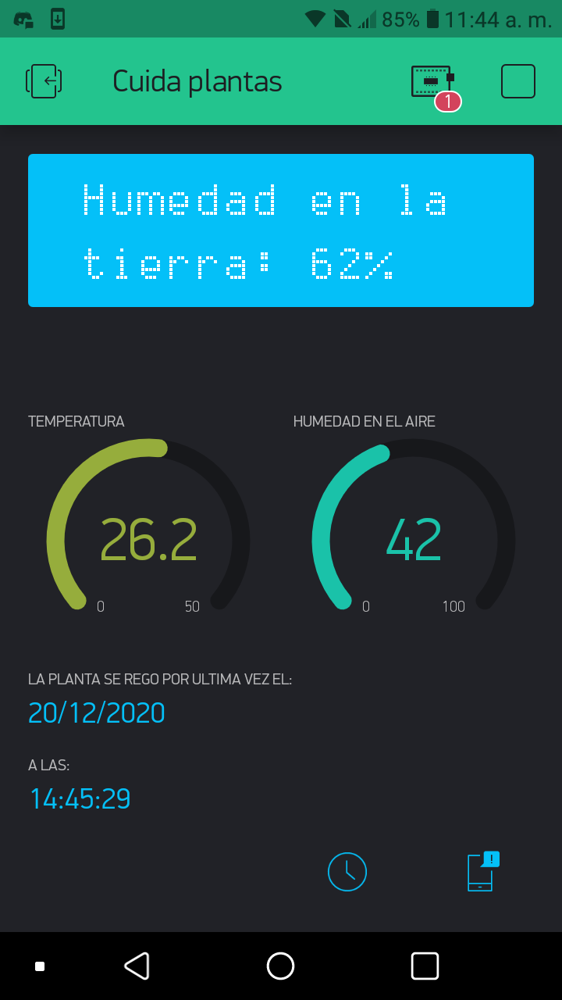
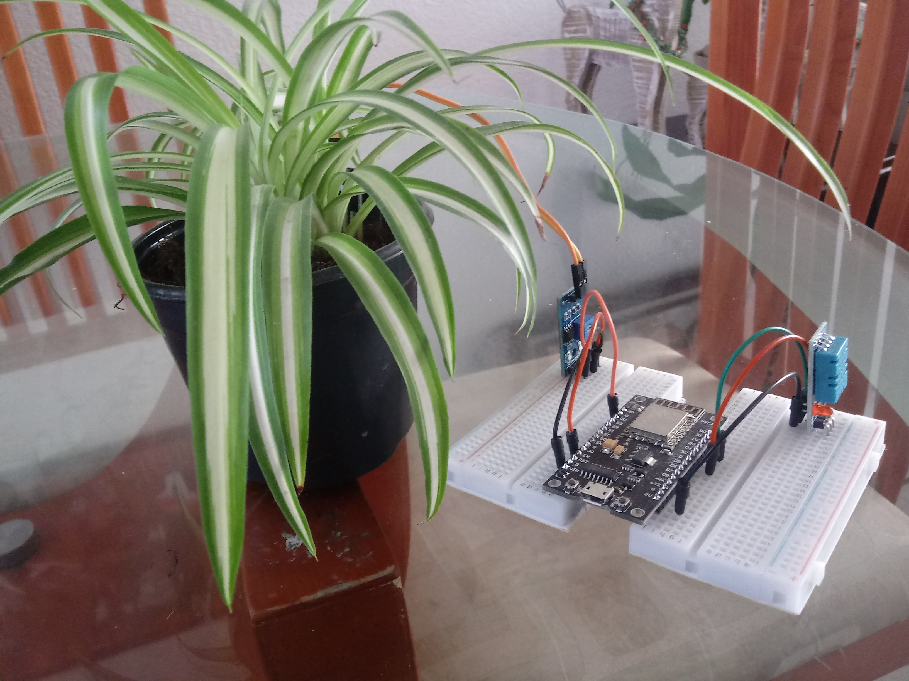
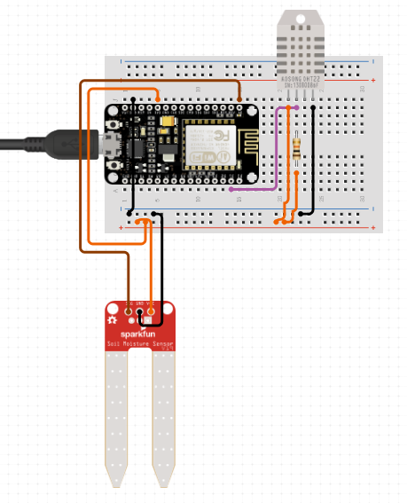

# Plant -IOT
Plant monitoring station using an esp8266 and blynk app

Components used:
<ul>
  <li>DHT11 humidity and temperature sensor</li>
  <li>Soil moisture sensor</li>
  <li>Esp8266</li>
  <li>Blynk library</li>
</ul>

To use it you need to download the Blynk app, start a new project, and copy your Auth code given by the app into the Arduino code.

>
>
